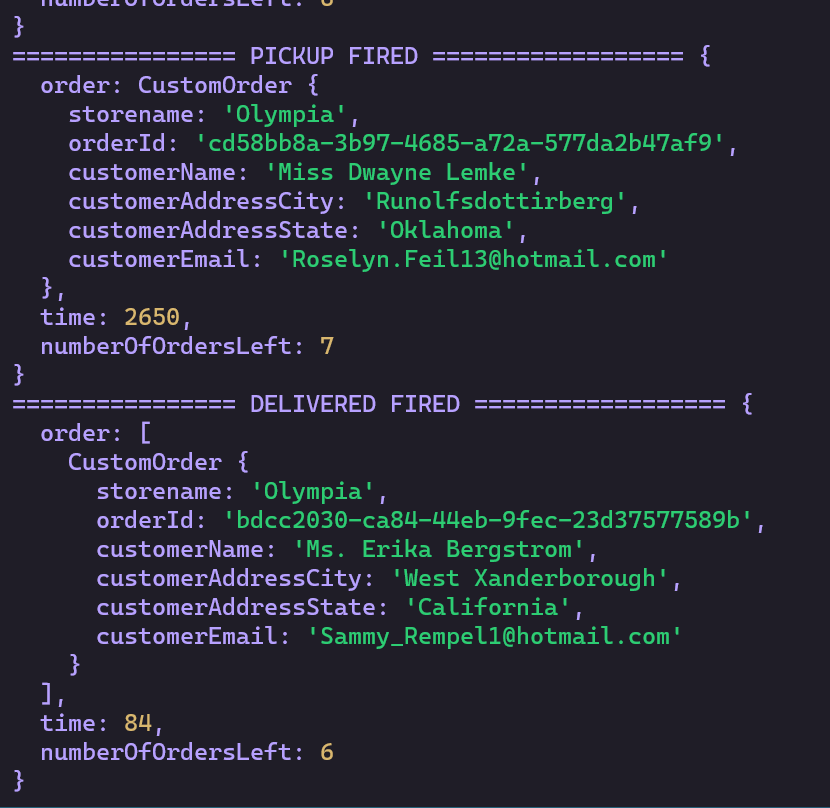

# caps

Event Driven Applications - Package tracking system using TCP, socket.io, node, express

## Author: Fizzo Pannosch

**Version**: 1.0.0

<!-- (increment the patch/fix version number if you make more commits past your first submission) -->

### 
 links and resources 

#### 
 [heroku deployed site](https://fizzo-caps.herokuapp.com/) 

#### 
 [github actions](https://github.com/fizzo999/caps/actions) 

#### 
 [ci/cd - github](https://github.com/fizzo999/caps/actions/runs/809042138) 

#### 
 [merged pull request - github](https://github.com/fizzo999/caps/pull/2) 

## 
 UML DIAGRAM 

<!-- 

 -->

## Overview

Event Driven Applications - Package tracking system using TCP, socket.io, node, express

## Setup

git clone repo from github link:
https://github.com/fizzo999/caps.git

.env requirements
PORT - Port Number
STORE_NAME=Olympia

#### npm install
(to install dependencies: express, dotenv, supertest, jest, faker)

#### Running the app
npm run start
produces console.log ' s of a stream of faker generated orders as they are fired from the event handler (events.emit) after having been declared with events.on

#### Tests
Unit Tests: npm run test

## Architecture

node.js based server that uses express library and dotenv package
tests performed with jest and supertest

## Change Log

05-03-2021 10:59pm - Application now has a fully-functional order generation on driver.js, vendor,js and all linked through hub.js.

## Credits and Collaborations

Number and name of feature: setup file structure, write driver.js, vendor.js, events.js, hub.js, test.js.yml - repo on github and deploy to heroku
Estimate of time needed to complete: 2 hours
Start time: 5:00 pm
Finish time: 9:00 pm
Actual time needed to complete: 4 hours

Number and name of feature: readme, bug fix
Estimate of time needed to complete: 2 hours
Start time: 8:00 pm
Finish time: 11:00 pm
Actual time needed to complete: 3 hours
